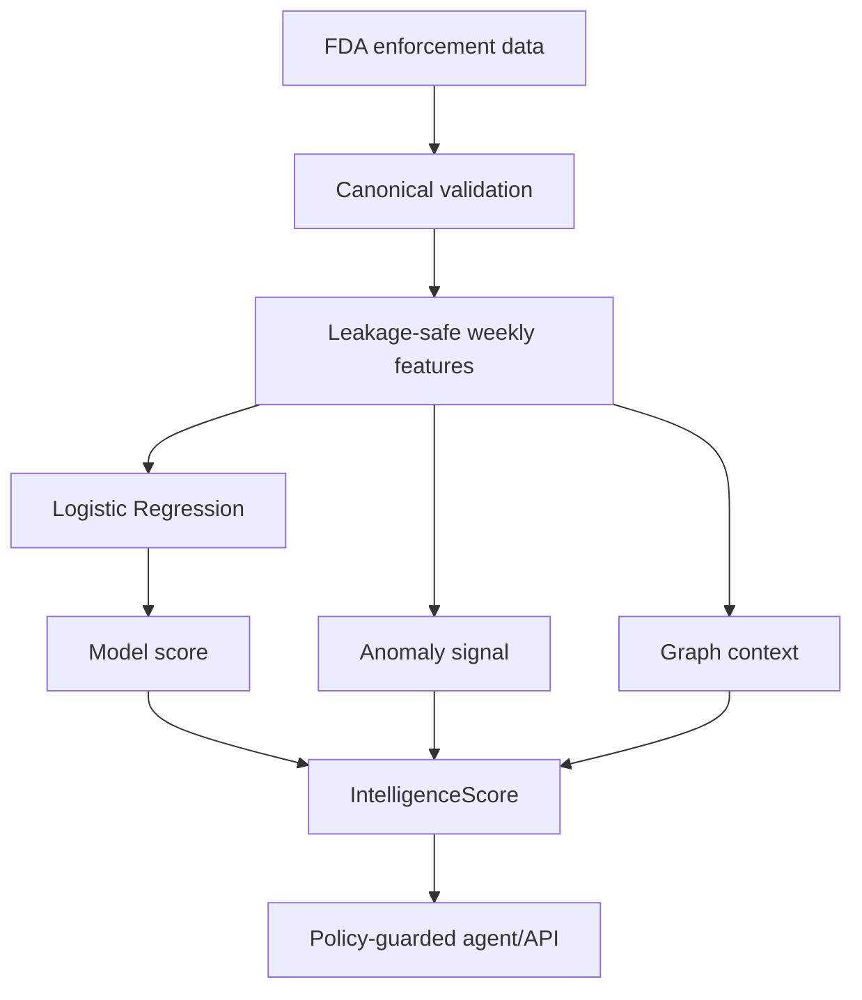

# SentinelFood AI

An explainable, safety-guarded food-safety intelligence prototype built from FDA enforcement data.

SentinelFood AI turns historical recall records into an operational prioritization workflow. It validates a canonical dataset, trains a leakage-aware Logistic Regression baseline, combines model, anomaly, and graph signals into an `IntelligenceScore`, and applies semantic safeguards before agent responses are returned.

> This is a decision-support prototype—not a food safety certification or medical risk model. `model_score` is a ranking/decision score, `IntelligenceScore` is not a risk percentage, and the system does not classify food as safe or unsafe.

## Project snapshot

| Item | Final baseline |
|---|---|
| Data source | FDA enforcement records |
| Canonical dataset | 29,317 records, 18 canonical fields |
| Date coverage | 2012-06-20 to 2026-08-19 |
| Target | At least one operational signal in the following 4 weeks |
| Validation | Time-based holdout with a 4-week purge window |
| Model | Logistic Regression, `class_weight="balanced"` |
| Primary threshold | 0.59 |
| Watchlist threshold | 0.45 |
| Holdout precision | 22.85% |
| Holdout recall | 67.93% |
| Holdout PR-AUC | 0.3405 |

The target is an operational signal proxy. The reported metrics must not be interpreted as estimates of real-world illness, toxicity, or product safety.

## Data source

The pipeline is based on the official [openFDA Food Enforcement Reports API](https://open.fda.gov/apis/food/enforcement/), which publishes publicly releasable recall records from the FDA Recall Enterprise System and is updated weekly. The date range above describes this project's frozen extraction, not the full API history.

## Architecture



`IntelligenceScore = 60% model component + 20% anomaly component + 20% graph component`

Each component is normalized to the 0–1 interval before the final 0–100 operational priority score is calculated.

## What is included

- Canonical schema and data-quality checks
- Exploratory summaries by source
- Preprocessing and Logistic Regression pipeline
- Time-based train/purge/holdout evaluation
- Threshold-specific operational metrics
- IntelligenceScore calculation and component audit columns
- Query policy guard and LLM rewrite validator
- CLI commands for validation, modeling, scoring, and policy checks
- Optional FastAPI service with `/health` and `/agent/query`
- Automated tests and a GitHub Actions workflow
- Docker configuration for the API

The original team project was modular. This repository presents the consolidated, portfolio-ready submission while preserving the frozen final policy.

## Repository structure

```text
sentinelfood-ai/
├── sentinelfood.py
├── examples/
│   ├── canonical_sample.csv
│   ├── frozen_manifest.example.json
│   └── operational_scores_sample.csv
├── tests/
│   └── test_sentinelfood.py
├── .github/workflows/tests.yml
├── Dockerfile
├── requirements.txt
└── requirements-dev.txt
```

## Quick start

```bash
python -m venv .venv
```

Activate the environment:

```bash
# Windows PowerShell
.venv\Scripts\Activate.ps1

# macOS / Linux
source .venv/bin/activate
```

Install dependencies:

```bash
pip install -r requirements-dev.txt
```

Inspect the frozen project policy:

```bash
python sentinelfood.py --mode info
```

Validate the included canonical sample:

```bash
python sentinelfood.py --mode validate \
  --canonical examples/canonical_sample.csv
```

Build an operational priority table:

```bash
python sentinelfood.py --mode score \
  --score-input examples/operational_scores_sample.csv \
  --score-output scored_output.csv
```

Check a guarded query:

```bash
python sentinelfood.py --mode policy \
  --query "Is this product safe?"
```

Run the API:

```bash
uvicorn sentinelfood:app --host 0.0.0.0 --port 8000
```

Then open `http://localhost:8000/docs`.

## Model evaluation

The model command expects a weekly feature table with `week`, `future_4w_signal_target`, and the features listed in a frozen manifest.

```bash
python sentinelfood.py --mode model \
  --features path/to/weekly_features.csv \
  --manifest examples/frozen_manifest.example.json
```

The full research dataset and internal experimental artifacts are intentionally not committed. This keeps the repository reproducible without publishing large or derived working files. The small files under `examples/` are synthetic and exist only to demonstrate the interface.

## Safety and interpretation rules

- Do not interpret `model_score` as a calibrated probability.
- Do not interpret `IntelligenceScore` as a toxicological or medical risk percentage.
- Do not make safe/unsafe consumption decisions.
- Do not infer causality from graph relationships.
- Do not invent brand, company, country, or source relationships.
- Treat model explanations as development evidence, not regulatory conclusions.

## Tests

```bash
pytest -q
```

The tests cover canonical validation, score construction, policy blocking, LLM rewrite validation, and time-based model evaluation.

## Technology choices

| Technology | Why it is used |
|---|---|
| pandas / NumPy | Transparent tabular processing and score construction |
| scikit-learn | Reproducible preprocessing and interpretable baseline modeling |
| FastAPI | Small typed service layer for demonstration and integration |
| pytest | Regression tests for analytical and semantic safeguards |
| GitHub Actions | Automated verification on each push and pull request |
| Docker | Reproducible API runtime |

## Current limitations

- Final baseline uses FDA data only.
- The target is a proxy derived from operational signals.
- Scores are not calibrated real-world probabilities.
- The consolidated repository demonstrates the core workflow; archived RASFF, Stage-2, and pair-suppression experiments are excluded.
- Prospective testing and persistent-signal target development remain future work.
